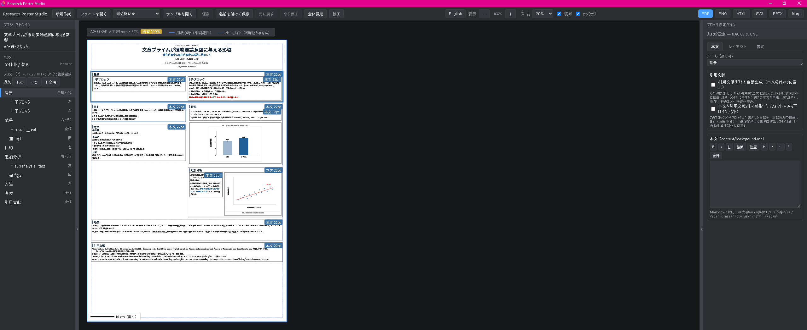

# Research Poster Studio

[](https://github.com/YukiInoueNakata/research_poster_studio/actions/workflows/ci.yml)
[](./LICENSE)
<!-- DOI badge (add after archiving a release on Zenodo — see Citation below):
[](https://doi.org/10.5281/zenodo.XXXXXXX) -->
<!-- npm badge (add if @rps/cli is published):
[](https://www.npmjs.com/package/@rps/cli) -->

研究ポスター専用の**構造化レイアウトエディタ**です。A0 / A1 などの学会ポスターを
YAML + Markdown で管理し、GUI でプレビューしながら **PDF / PNG / HTML / SVG /
PPTX / Marp** に書き出せます。

*A structured layout editor for academic research posters. Manage A0/A1 posters as
YAML + Markdown, preview them in a desktop GUI, and export to PDF / PNG / HTML /
SVG / PPTX / Marp.*

ポスターの中身はすべてプレーンテキスト（YAML + Markdown）なので、Claude Code /
Codex などの **Agent LLM がそのまま読んで編集できます**。AI エージェントによる
支援を前提に設計しています。

*Because every poster is plain text, AI coding agents (Claude Code, Codex, …) can
read and edit it directly. The tool is designed with LLM-agent assistance in mind.*

PowerPoint のような自由配置ではなく、内容を「ブロック / カラム / 高さモード」で
構造的に管理するため、研究数・図表数・文字量が変わってもレイアウトが破綻しにくい
設計です。

*Layout is structured by blocks, columns, and height modes rather than free-form
DTP, so it stays robust as the amount of content changes.*

技術構成 / Stack: **Tauri v2 + React + TypeScript + Vite**（Windows / macOS / Linux）。



## 背景と目的 / Statement of need

学会ポスターは A0・A1 など大判で、多数のブロックと図表を限られた面積に収める必要が
あります。PowerPoint や Illustrator などの自由配置 DTP では、テキスト量や図表数が変わる
たびに要素の位置とサイズを手作業で調整することになり、レイアウトが崩れやすく、変更履歴の
追跡や再現も困難です。Research Poster Studio は、ポスターをカラム・ブロック・高さモードで
**構造的に**記述し、内容量が変わってもレイアウトが破綻しにくくします。ポスターの実体は
プレーンテキスト（YAML + Markdown + BibTeX）と図表ファイルなので、Git でバージョン管理でき、
差分レビューや AI エージェント（Claude Code / Codex 等）による編集にも適します。想定利用者は、
学会ポスターを作成する研究者、とりわけ再現可能・版管理された制作フローや LLM 支援を求める
利用者です。

*Conference posters are large-format (A0/A1) and must fit many blocks and figures into a
fixed area. In free-placement DTP tools such as PowerPoint or Illustrator, every change in
text length or figure count forces manual repositioning and resizing, so layouts break
easily and are hard to version or reproduce. Research Poster Studio describes a poster
**structurally** through columns, blocks, and height modes, keeping the layout robust as
content changes. Because a poster is plain text (YAML + Markdown + BibTeX) plus figure
files, it is Git-versionable and amenable to diff review and AI-agent editing (Claude Code,
Codex). Target users are researchers preparing conference posters — especially those who
want a reproducible, version-controlled workflow or LLM-assisted authoring.*

## 主な機能 / Features

- **用紙・レイアウト** — A0/A1/A2・インチ系プリセット・カスタムサイズ、1〜6 カラム＋
  全幅ブロック、高さモード（auto/fixed/flex/locked）と高さ連動、入れ子ブロック。
  *Paper & layout: A0–A2, inch presets, custom sizes; 1–6 columns + full-width;
  height modes with row-sync; nested blocks.*
- **本文・装飾** — Markdown 本文（ブロック別 `content/*.md` または単一 `content.md`）、
  見出しバー・番号バッジ・カード型・コールアウト箱・チャート・**数式（LaTeX）**、
  リストの自動採番。
  *Content: Markdown body (per-block or single file), heading bars/badges/cards/
  callouts/charts/**math (LaTeX)**, auto-numbered lists.*
- **図表** — PNG/JPEG/SVG に加え PDF・CSV 表・Mermaid・Graphviz・EMF/WMF、
  回り込み・整列・トリミング・ギャラリー・白背景の透過。
  *Figures: images plus PDF, CSV tables, Mermaid, Graphviz, EMF/WMF, with float,
  alignment, cropping, galleries, and white-background knockout.*
- **引用文献** — BibTeX（本文 `[@key]` 展開、apa7 / jpa / カスタム、文献リスト自動生成）。
  *Citations: BibTeX with `[@key]` expansion and an auto-generated reference list.*
- **仕上げ・運用** — 実寸プレビュー、あふれ等の各種警告、校正モード、Undo/Redo、
  自動バックアップ、UI の日英切替、着せ替え・背景画像。
  *Workflow: real-size preview, overflow warnings, a proofreading mode, undo/redo,
  auto-backup, a JA/EN UI toggle, and themes.*
- **出力** — PDF / PNG / HTML / SVG / PPTX / Marp（忠実度は `docs/export-matrix.md`）。
  *Export to PDF / PNG / HTML / SVG / PPTX / Marp.*
- **エージェント支援** — `rps` CLI（validate / info / explain / export）、VS Code 拡張
  （検証・プレビュー・警告）、Agent LLM 用 Skill を同梱。
  *Agent support: an `rps` CLI, a VS Code extension (validate/preview/warnings),
  and a bundled LLM Skill — all in this repo.*

詳細な仕様は `docs/design.md`（設計書）を参照してください。
*See `docs/design.md` for the full specification.*

## ダウンロード / Download

ビルド済みインストーラは [Releases](../../releases) から入手できます
（Windows `.msi` / `.exe`、macOS universal `.dmg`、Linux `.AppImage` / `.deb` / `.rpm`）。
*Prebuilt installers are on the [Releases](../../releases) page.*

アプリは未署名のため、初回起動時に OS の警告が出ることがあります。回避手順:
*The app is unsigned, so your OS may warn on first launch:*

- **Windows（SmartScreen）**: 「詳細情報」→「実行」。
- **macOS（Gatekeeper）**: アプリを右クリック →「開く」→「開く」。または
  システム設定 → プライバシーとセキュリティ →「このまま開く」。

自分でビルドする場合は下記の手順に従ってください。
*To build from source, follow the steps below.*

## 必要環境 / Requirements

まず用途を選んでください。必要なものが変わります。
*Pick your use case first — the prerequisites differ.*

- **アプリを使うだけ / Just use the app** → 上の [Download](#ダウンロード--download) から
  インストーラを入れるだけです。以下は何もインストール不要。
  *Install from the Releases page. Nothing below is required.*
- **CLI（`rps`）を使う／ソースから動かす / Use the CLI or run from source** → 下の
  「1. Node.js」を入れてください。
  *Install Node.js (step 1 below).*
- **デスクトップアプリを自分でビルド / Build the desktop app yourself** → 「1」に加えて
  「2. Rust」と「3. Tauri 前提」も入れてください。
  *Additionally install Rust (step 2) and the Tauri prerequisites (step 3).*

### 1. Node.js（CLI・ソース利用に必須 / required for the CLI and source）

Node.js を入れると **`npm` も一緒に入ります**（npm は Node.js に同梱のコマンドなので、
別途インストールは不要です）。
*Installing Node.js also installs `npm` — npm ships with Node.js, so you do not install it
separately.*

- **インストール / Install**: 公式サイト <https://nodejs.org/> から **LTS 版（20 以上）** を入れる。
  - Windows: ダウンロードした `.msi` を実行。または PowerShell で `winget install OpenJS.NodeJS.LTS`
  - macOS: 公式インストーラ、または `brew install node`
  - Linux: 各ディストリのパッケージ、または [nvm](https://github.com/nvm-sh/nvm)
- **必要バージョン / Version**: **Node.js 20.19 以上**（開発・CI は 22 で確認 / tested on 22）。
- **確認 / Verify**: ターミナル（Windows は PowerShell）で次を実行し、両方がバージョン番号を
  表示すれば準備完了です。
  ```bash
  node -v      # 例 / e.g. v22.x.x
  npm -v       # 例 / e.g. 10.x.x
  ```

### 2. Rust / Cargo（デスクトップアプリをソースからビルドする場合のみ / only to build the app）

CLI やビルド済みアプリの利用には不要です。
*Not needed for the CLI or the prebuilt app.*

- <https://rustup.rs/> から stable を入れる。確認 / verify: `cargo --version`

### 3. OS ごとの Tauri 前提（同じくビルドする場合のみ / only when building）

- **Windows**: WebView2（Windows 11 は標準搭載。無ければ Microsoft の Evergreen ランタイム）
- **macOS**: Xcode Command Line Tools（`xcode-select --install`）
- **Linux**: webkit2gtk（例: Ubuntu は `libwebkit2gtk-4.1-dev`）

## クイックスタート / Quick start

「1. Node.js」まで済んでいる前提です。ターミナル（Windows は PowerShell）で、まず
リポジトリを取得し、そのフォルダの中で各コマンドを実行します。
*Assuming Node.js (step 1) is installed. In a terminal, get the repository and run the
commands inside that folder.*

```bash
git clone https://github.com/YukiInoueNakata/research_poster_studio.git
cd research_poster_studio     # 以降のコマンドはこのフォルダ内で / run everything here
npm install                   # 依存をまとめて取得（初回のみ）/ install deps (first time)
npm run dev                   # 共有ライブラリを建てて GUI を起動 / build libs, then launch the GUI
```

`npm run dev` はソースからデスクトップアプリを起動するため、上の「2. Rust」「3. Tauri 前提」も
必要です。GUI ではなく `rps` コマンドだけ使いたい場合は Rust なしで動きます（下の
[CLI](#clirps) 参照）。
*`npm run dev` runs the desktop app from source, so it also needs Rust (step 2) and the
Tauri prerequisites (step 3). If you only want the `rps` command, no Rust is needed — see
[CLI](#clirps) below.*

起動直後のダイアログから、新規作成（設定ウィザード）・サンプルを開く・
ファイルを開く・最近開いた一覧を選べます。

*On launch, a dialog lets you create a new project (a setup wizard), open a sample,
open an existing `poster.yaml`, or reopen a recent project.*

## CLI（`rps`）

`rps` は Rust なしで使えます（デスクトップアプリのビルドは不要）。「1. Node.js」だけ
入っていれば動きます。まだの場合は先にコードを取得して依存を入れてください。
*The `rps` CLI needs no Rust — only Node.js (step 1). If you have not done so yet, get the
code and install dependencies first:*

```bash
git clone https://github.com/YukiInoueNakata/research_poster_studio.git
cd research_poster_studio
npm install
```

CLI は共有ライブラリを使うため、**続けて `npm run build:libs` を一度実行**します（以降は
不要）。パスはリポジトリルートからの相対で指定できます。
*Then run `npm run build:libs` once (the CLI uses the shared libraries). Paths are resolved
relative to the repository root.*

```bash
npm run build:libs                             # 初回のみ / once

npm run rps -- validate <project-dir>          # スキーマ＋警告チェック / validate
npm run rps -- explain  <project-dir> [--json] # Agent 向け構造要約 / structure summary
npm run rps -- export   pdf <project-dir>      # exports/ に出力 / export
npm run rps -- init     <dir> --template quantitative
```

`npm run rps --` が `rps` コマンド本体で、`--` の後ろに `rps` の引数を書きます
（例: `npm run rps -- validate examples/sample-full`）。`<project-dir>` は
poster.yaml のあるフォルダに置き換えてください。同梱サンプルは `examples/sample-full` です。
*`npm run rps --` invokes the CLI; put the `rps` arguments after `--`. Replace
`<project-dir>` with a folder containing `poster.yaml` (a bundled sample is
`examples/sample-full`).*

HTML / SVG / Marp は追加依存なしで出力できます。PDF / PNG は初回のみ
`npx playwright install chromium` が必要です。
*(HTML/SVG/Marp need no extra deps; PDF/PNG require `npx playwright install
chromium` once.)*

### 動作確認 / Quick verification

インストールが成功したかは、同梱サンプルを検証して PDF に書き出すと確認できます。
*To confirm a working installation, validate a bundled sample and export it to PDF:*

```bash
git clone https://github.com/YukiInoueNakata/research_poster_studio.git
cd research_poster_studio
npm install
npm run build:libs
npx playwright install chromium                # PDF/PNG 出力に必要 / needed for PDF

npm run rps -- validate examples/sample-full   # → ✓ 0 errors, 0 warnings
npm run rps -- export pdf examples/sample-full # → examples/sample-full/exports/poster.pdf
```

最後のコマンドで `examples/sample-full/exports/poster.pdf`（A0 実寸）が生成されます。
*The last command writes `examples/sample-full/exports/poster.pdf` at full A0 size.*

## ビルド・検証 / Build & test

```bash
npm run build:libs                       # 共有ライブラリ / build shared libs
npm run tauri build -w @rps/desktop-app  # 配布物 / desktop installers
npm run typecheck                        # 全ワークスペースの型チェック / typecheck
npm run smoke                            # smoke test（要 build:libs）
```

GUI の目視確認は `docs/acceptance-tests.md`（手動受け入れテスト表）に従います。
*Manual GUI checks follow `docs/acceptance-tests.md`.*

## リポジトリ構成 / Repository layout

```text
packages/
  core/              @rps/core      型 / Zod schema / validate / layout（DOM 非依存）
  renderer/          @rps/renderer  PosterCanvas / HTML / SVG / Marp / markdown
  exporter/          @rps/exporter  HTML → PDF/PNG（Playwright）
  cli/               @rps/cli       rps（init / validate / explain / preview / export）
  desktop-app/       @rps/desktop-app   Tauri v2 + React GUI
  vscode-extension/  @rps/vscode-extension  VS Code 拡張（validate / preview / warnings）
examples/            サンプル（sample-poster / sample-nested / sample-full / sample-combined）
skills/research-poster-studio/  Agent LLM 用 Skill（SKILL.md / schema / templates / prompts）
docs/                design.md / architecture.md / export-matrix.md / agent-workflow.md ほか
```

レイアウト計算・検証・レンダリングは共有パッケージ（`@rps/core` / `@rps/renderer` /
`@rps/exporter`）にあり、デスクトップ・`rps` CLI・VS Code 拡張が同じ実装を使います。
*Layout, validation, and rendering live in shared packages, reused by the desktop
app, the `rps` CLI, and the VS Code extension (see `docs/architecture.md`).*

### ポスター1件の構成 / A single poster project

```text
poster-project/
├─ poster.yaml      # 構造・レイアウト・テーマ・ブロック・図表・出力設定
├─ content/*.md     # 各ブロックの本文（または単一 content.md）
├─ figures/*        # 図表（PNG/JPEG/SVG/PDF/CSV/Mermaid/Graphviz）
├─ references.bib   # BibTeX（任意 / optional）
├─ exports/         # 生成物 / generated outputs（git 管理外）
└─ backups/         # 自動バックアップ / auto-backups（git 管理外）
```

`exports/` と `backups/` は自動生成され、手で編集せず git にもコミットしません。
スキーマは `skills/research-poster-studio/schema/poster.schema.json` です。
*`exports/` and `backups/` are generated; don't edit or commit them.*

## 既知の制限 / Notes & limitations

- あふれは**警告のみ**で、最小可読サイズ未満への自動縮小はしません。
  *Overflow is reported as a warning; the tool never auto-shrinks below the
  minimum readable size.*
- PPTX は座標・テキスト・画像の近似出力です（提出用は PDF を推奨）。
  *PPTX is an approximate export; PDF is recommended for submission.*
- CLI の `rps export` は Graphviz を変換しますが、Mermaid と PDF 貼り込みは
  デスクトップアプリでのみ変換されます（CLI ではプレースホルダ）。
  *In the CLI, Mermaid and embedded PDFs render only in the desktop app.*

## 貢献・サポート / Contributing & support

- **貢献 / Contributing** — 開発環境・PR の出し方は [`CONTRIBUTING.md`](./CONTRIBUTING.md)、
  行動規範は [`CODE_OF_CONDUCT.md`](./CODE_OF_CONDUCT.md) を参照してください。
  *How to set up and open a PR: [`CONTRIBUTING.md`](./CONTRIBUTING.md); conduct: [`CODE_OF_CONDUCT.md`](./CODE_OF_CONDUCT.md).*
- **不具合報告・機能要望 / Issues** — [GitHub Issues](https://github.com/YukiInoueNakata/research_poster_studio/issues)
  にテンプレートから登録してください。
  *Report bugs or request features via [GitHub Issues](https://github.com/YukiInoueNakata/research_poster_studio/issues).*
- **使い方の相談 / Support** — 相談先は [`SUPPORT.md`](./SUPPORT.md)（GitHub Issues と
  作者メール dj.y.nakata@gmail.com）。
  *Where to get help: [`SUPPORT.md`](./SUPPORT.md) (GitHub Issues, or email dj.y.nakata@gmail.com).*

## ライセンス / License & attribution

作者 / Author: 中田友貴（Yuki Inoue Nakata）。研究・教育用途を想定したツールです。

本リポジトリは **Apache License 2.0** で公開しています（全文は [`LICENSE`](./LICENSE)、
帰属表示は [`NOTICE`](./NOTICE)）。
*Licensed under the **Apache License 2.0** (see [`LICENSE`](./LICENSE) and [`NOTICE`](./NOTICE)).*

- **自由な利用 / Permissive** — 出典表示（著作権・ライセンス・NOTICE の保持）のもとで、
  **営利・非営利を問わず**自由に利用・改変・再配布できます。
  *Free to use, modify, and redistribute for any purpose, including commercial, with attribution.*
- **特許許諾 / Patent grant** — Apache-2.0 は貢献者からの特許ライセンスを含みます。
  *Includes an express patent license from contributors.*
- **表示 / Attribution** — 改変ファイルにはその旨を明示し、`LICENSE`・`NOTICE` を同梱してください。
  *Retain notices; state changes; include `LICENSE` and `NOTICE` in redistributions.*

連絡先 / contact: dj.y.nakata@gmail.com

## 引用 / Citation

本ソフトウェアを利用した場合は引用してください。機械可読なメタデータは
[`CITATION.cff`](./CITATION.cff) にあります（GitHub の "Cite this repository" からも取得できます）。
*If you use this software, please cite it. Machine-readable metadata is in
[`CITATION.cff`](./CITATION.cff) (also via GitHub's "Cite this repository").*

リリースを Zenodo にアーカイブして DOI を取得したら、下記の `DOI` を確定値に置き換えてください。
*After archiving a release on Zenodo, replace the `DOI` placeholder below with the minted value.*

```bibtex
@software{nakata_research_poster_studio,
  author  = {Nakata, Yuki Inoue},
  title   = {Research Poster Studio},
  year    = {2026},
  url     = {https://github.com/YukiInoueNakata/research_poster_studio},
  version = {0.1.0},
  doi     = {10.5281/zenodo.XXXXXXX}
}
```
