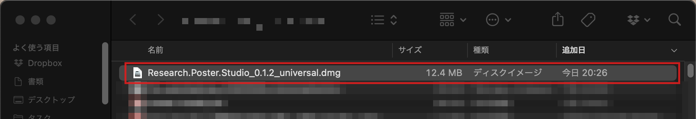
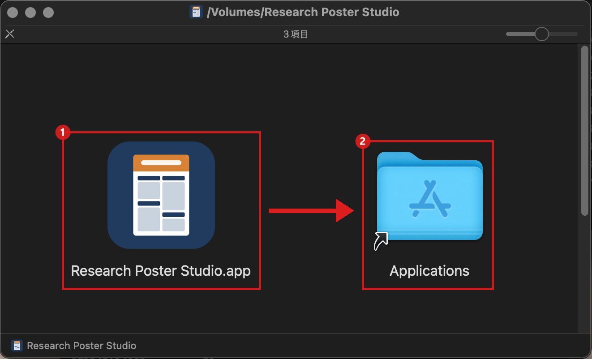
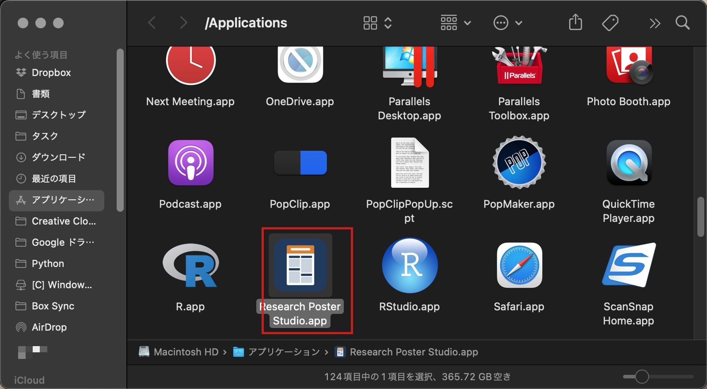
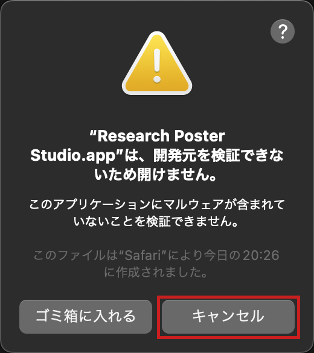
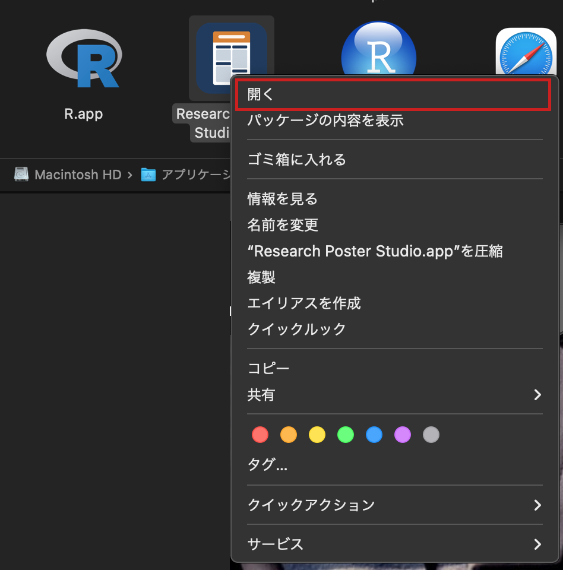
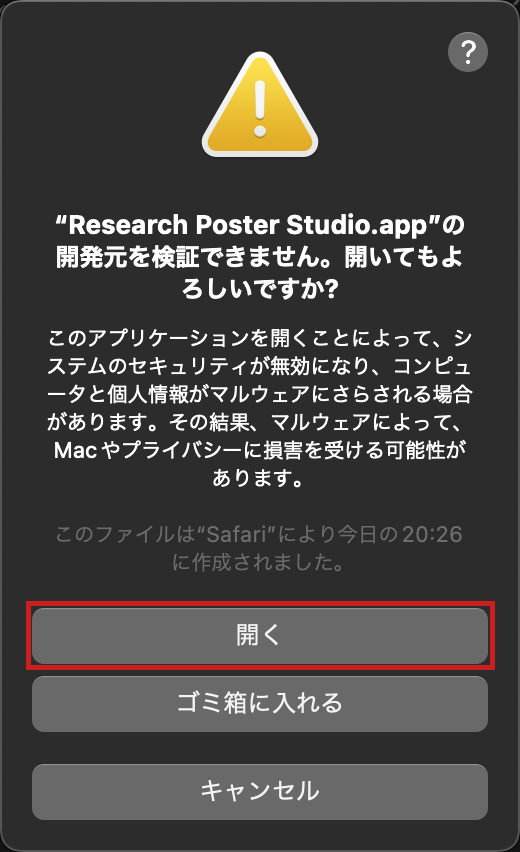
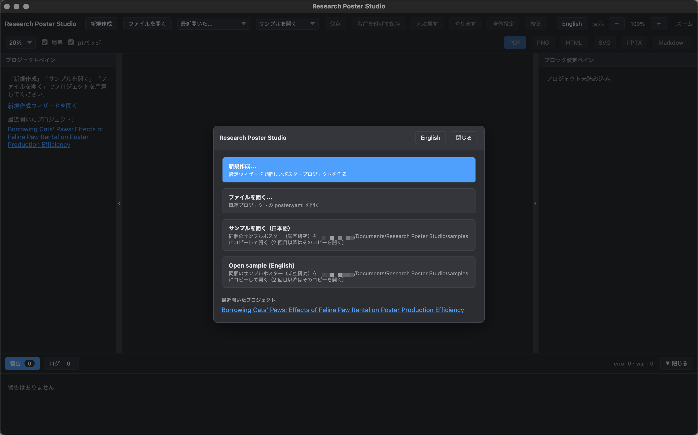

# はじめてのガイド（インストールから PDF まで）

Research Poster Studio（RPS）を，はじめての人がインストールして，ポスターを PDF にするまでの手順です．
画面の写真のとおりに，赤い枠のところを順に押していけば進めます．

English version: [getting-started.en.md](getting-started.en.md)

- [1. どれをダウンロードすればよいか](#1-どれをダウンロードすればよいか)
- [2. Windows（.exe）](#2-windowsexe)
- [3. Windows（.msi）](#3-windowsmsi)
- [4. Mac（.dmg）](#4-macdmg)
- [5. Ubuntu（.deb）](#5-ubuntudeb)
- [6. Ubuntu（.AppImage）](#6-ubuntuappimage)
- [7. 自分でビルドして動かす（ソースから）](#7-自分でビルドして動かすソースから)
- [8. 使ってみる](#8-使ってみる)

## 1. どれをダウンロードすればよいか

ダウンロードは [Releases](https://github.com/YukiInoueNakata/research_poster_studio/releases) のページから行います．
いちばん上の版を開き，「Assets」の一覧から，自分のパソコンに合うファイルを 1 つ選びます．

| パソコン | おすすめ | ファイル名の例 |
|---|---|---|
| Windows | `.exe`（管理者の権限がいらない） | `Research.Poster.Studio_0.1.2_x64-setup.exe` |
| Windows（会社や大学で，ふつうの手順で消せるほうがよいとき） | `.msi` | `Research.Poster.Studio_0.1.2_x64_en-US.msi` |
| Mac（Intel でも Apple シリコンでも同じ） | `.dmg` | `Research.Poster.Studio_0.1.2_universal.dmg` |
| Ubuntu | `.deb` | `Research.Poster.Studio_0.1.2_amd64.deb` |
| Ubuntu（インストールせずに使いたいとき） | `.AppImage` | `Research.Poster.Studio_0.1.2_amd64.AppImage` |

ファイル名の `0.1.2` は版の番号です．新しい版では数字が変わります．

<!-- img: win-01-releases.png / win-02-assets.png -->

## 2. Windows（.exe）

### インストール

1. Releases のページで `…_x64-setup.exe` を押して，ダウンロードします．
   <!-- img: win-03-downloaded.png -->
2. ダウンロードしたファイルをダブルクリックします．
   <!-- img: win-04-open-installer.png -->
3. 「Windows によって PC が保護されました」と出たら，「詳細情報」を押します．
   アプリに電子署名が付いていないため，この画面が出ます．
   <!-- img: win-05-smartscreen.png -->
4. 「実行」を押します．
   <!-- img: win-06-smartscreen-run.png -->
5. インストーラの画面で，「次へ」や「インストール」を順に押します．
   <!-- img: win-07a… -->
6. 終わったら「完了」を押します．「Research Poster Studio を実行」にチェックがあれば，そのまま起動します．
   <!-- img: win-09-setup-finish.png -->

### 起動

スタートメニューを開いて「Research」と入力し，「Research Poster Studio」を押します．

<!-- img: win-10-start-menu.png -->

### アンインストール

1. 「設定」→「アプリ」→「インストールされているアプリ」を開き，「Research Poster Studio」の「…」を押します．
   <!-- img: win-20-apps-list.png -->
2. 「アンインストール」を押し，表示に従って進めます．
   <!-- img: win-21-uninstall-menu.png / win-22… -->

作ったポスター（`ドキュメント\Research Poster Studio` など）は消えません．要らなければ自分で削除してください．

> **アンインストールが止まる場合**
> `.exe` 版のアンインストーラ（`uninstall.exe`）には電子署名が付いていません．そのため，
> **スマート アプリ コントロール**がオンのパソコンでは，アンインストーラが止められ，最後まで進まないことがあります．
> このときは `uninstall.exe` とインストール先のフォルダが残ります．
> アプリを閉じてから，次のフォルダを自分で削除してください．
>
> ```
> %LocalAppData%\Research Poster Studio
> ```
>
> エクスプローラーのアドレスバーに `%LocalAppData%` と入力して Enter を押すと，このフォルダの場所へ移動できます．
> スマート アプリ コントロールがオフのパソコンや，`.msi` 版では，ふつうのアンインストールで消えます．

## 3. Windows（.msi）

### インストール

1. Releases のページで `…_x64_en-US.msi` を押して，ダウンロードします．
2. ダウンロードしたファイルをダブルクリックします．
   「Windows によって PC が保護されました」と出たら，「詳細情報」→「実行」を押します（[2. の 3〜4](#インストール) と同じ）．
3. インストーラの画面で「Next」を押して進めます．
   途中で「このアプリがデバイスに変更を加えることを許可しますか?」と出たら「はい」を押します．
   `.msi` 版はパソコン全体にインストールするので，管理者の確認が出ます．
   <!-- img: 長谷川さんの写真（msi インストール） -->
4. 「Finish」を押して終わります．

起動のしかたは `.exe` 版と同じです（スタートメニューで「Research」と入力）．

### アンインストール

「設定」→「アプリ」→「インストールされているアプリ」→「Research Poster Studio」の「…」→「アンインストール」の順に押します．
`.msi` 版は，スマート アプリ コントロールがオンでも，ふつうに消せます．

<!-- img: 長谷川さんの写真（msi アンインストール） -->

## 4. Mac（.dmg）

### インストール

1. Releases のページで `…_universal.dmg` を押して，ダウンロードします．
   ダウンロードしたファイルは「ダウンロード」フォルダに入ります．これをダブルクリックします．

   

2. 開いた窓で，「Research Poster Studio.app」のアイコン（1）を，「Applications」のフォルダ（2）の上までドラッグして離します．
   これでアプリが「アプリケーション」フォルダにコピーされます．

   

3. Finder で「アプリケーション」フォルダを開き，「Research Poster Studio」をダブルクリックします．

   

4. 「開発元を検証できないため開けません」と出ます．アプリに電子署名が付いていないためです．
   ここでは「キャンセル」を押します．**「ゴミ箱に入れる」は押さないでください．**

   

5. もう一度「アプリケーション」フォルダで，「Research Poster Studio」を**右クリック**します
   （トラックパッドなら 2 本の指でクリック，または control キーを押しながらクリック）．出てきたメニューの「開く」を押します．

   

6. 「開いてもよろしいですか?」と出たら，「開く」を押します．

   

7. アプリが起動します．次からは，ふつうにダブルクリックするだけで起動します（右クリックで開くのは初回だけです）．

   

macOS 13 以降で 5〜6 のやり方では開けないときは，「システム設定」→「プライバシーとセキュリティ」を開き，下のほうにある「このまま開く」を押します．

> **「壊れているため開けません」と出る場合**
> 「ターミナル」（アプリケーション → ユーティリティ）を開き，次の 1 行を貼り付けて Enter を押してから，もう一度開いてください．
>
> ```bash
> xattr -dr com.apple.quarantine "/Applications/Research Poster Studio.app"
> ```

### アンインストール

「アプリケーション」フォルダの「Research Poster Studio」をゴミ箱へ移します．

## 5. Ubuntu（.deb）

### インストール

1. Releases のページで `…_amd64.deb` を押して，ダウンロードします．
2. 「端末」（ターミナル）を開き，ダウンロードしたフォルダへ移動します．

   ```bash
   cd ~/ダウンロード      # 英語の環境では cd ~/Downloads
   ```

3. 次を実行します．`0.1.2` は，ダウンロードしたファイルの版の番号に合わせて書き換えてください．

   ```bash
   sudo apt install ./Research.Poster.Studio_0.1.2_amd64.deb
   ```

   パスワードを聞かれたら，ログインのパスワードを入力します（入力しても画面には何も表示されません）．
   `sudo dpkg -i Research.Poster.Studio_0.1.2_amd64.deb` でもインストールできますが，
   必要な部品（WebKitGTK など）が足りないと失敗します．`apt install` は足りない部品も一緒に入れます．

### 起動

画面左下の「アプリを表示」から「Research Poster Studio」を探して押します．

### アンインストール

```bash
sudo apt remove research-poster-studio
```

消えたかどうかは次で確かめられます．何も表示されなければ，アンインストールは終わっています．

```bash
dpkg -l | grep -i poster
```

## 6. Ubuntu（.AppImage）

インストールせずに，ファイル 1 つで動かす方法です．

### 準備（初回だけ）

1. Releases のページで `…_amd64.AppImage` を押して，ダウンロードします．
2. 端末を開き，ダウンロードしたフォルダへ移動して，実行できるようにします．`0.1.2` は版の番号に合わせてください．

   ```bash
   cd ~/ダウンロード      # 英語の環境では cd ~/Downloads
   chmod +x ./Research.Poster.Studio_0.1.2_amd64.AppImage
   ```

### 起動

```bash
./Research.Poster.Studio_0.1.2_amd64.AppImage
```

端末に `canberra-gtk-module` や `libgvfscommon.so: undefined symbol` という表示が出ることがあります．
アプリが起動していれば，気にしなくてかまいません．
起動しないで `libfuse.so.2` が見つからないと出る場合は，`sudo apt install libfuse2t64` を実行してから，もう一度起動してください（Ubuntu 24.04 の場合）．

### 削除

ダウンロードした `.AppImage` のファイルを削除します．

## 7. 自分でビルドして動かす（ソースから）

最新の修正を試したいときや，開発に参加するときの方法です．
Node.js・Rust・Git などの準備は，README の
[Windows でゼロからセットアップする](../README.md#windows-でゼロからセットアップする--windows-setup-from-scratch) を見てください．
以下は，準備が終わり，`git clone` でリポジトリを取得したあとの手順です．

### 起動

1. PowerShell（Mac と Ubuntu では「ターミナル」）を開きます．
2. リポジトリのフォルダへ移動します．場所は，`git clone` を実行したフォルダの中の `research_poster_studio` です．

   ```powershell
   cd "C:\Users\<名前>\research_poster_studio"
   ```

3. 次を実行します．アプリの窓が開きます．

   ```powershell
   npm run dev
   ```

   アプリを閉じると，コマンドも終わります．

### 新しい版に更新する

```powershell
cd "C:\Users\<名前>\research_poster_studio"
git pull
npm install
npm run dev
```

- `npm install` は，使っている部品（ライブラリ）が変わったときに必要です．変わっていなければすぐ終わるので，毎回実行してかまいません．
  部品が変わったかを先に確かめたいときは，`git pull` のあとに `git diff --name-only HEAD@{1} HEAD` を実行し，
  `package.json` か `package-lock.json` が表示されたときだけ `npm install` を実行します．
- `npm run dev` は，起動の前に共有ライブラリ（core・renderer・exporter）のビルド（`npm run build:libs`）も行います．
  `npm run build:libs` を別に実行する必要はありません．

## 8. 使ってみる

<!-- 画像は Windows で撮影．Mac でも操作は同じ（Ctrl を ⌘ に読み替える） -->

### サンプルを開く

1. 起動すると，最初に「Research Poster Studio」の小さな画面が出ます．「サンプルを開く（日本語）」を押します．
   サンプルは `ドキュメント\Research Poster Studio\samples` にコピーされ，自由に書き換えられます．
   <!-- img: app-01-start-ja.png -->
2. サンプルのポスターが開きます．画面の各部の名前は次のとおりです．
   <!-- img: app-02-overview-ja.png（番号の説明を付ける） -->

### 文字を直す

1. 真ん中のポスターで，直したい文章をクリックします．
   <!-- img: app-10-click-block-ja.png -->
2. 右側に，その文章の編集欄が出ます．
   <!-- img: app-11-editor-ja.png -->
3. 編集欄で文章を書き換えると，ポスターにすぐ反映されます．
   <!-- img: app-12-typed-ja.png -->
4. まちがえたときは「元に戻す」を押します（Ctrl+Z でも戻せます）．
   <!-- img: app-13-undo-ja.png -->
5. 「保存」を押して保存します（Ctrl+S でも保存できます）．
   <!-- img: app-14-save-ja.png -->

### PDF にする

1. 右上の「PDF」を押します．
   <!-- img: app-30-export-buttons-ja.png -->
2. 印刷の画面が出ます．次のように設定します．
   - 送信先: 「PDF に保存」
   - 用紙サイズ: ポスターと同じ大きさ（A0 なら A0）
   - 余白: なし
   - 倍率: 100%
   <!-- img: app-31〜36 -->
3. 「保存」を押し，保存する場所と名前を決めます．
   <!-- img: app-37-save-dialog-ja.png -->
4. できた PDF を開いて，ポスター全体が 1 枚に入っていることを確かめます．
   <!-- img: app-38-pdf-result-ja.png -->

Mac では，印刷の画面の「用紙サイズ」に A0 が無いので，「カスタムサイズを管理」で 841 × 1189 mm（余白 0）を作って選びます．
くわしくは README の [デスクトップアプリから PDF を書き出す](../README.md#デスクトップアプリから-pdf-を書き出す--pdf-from-the-desktop-app) を見てください．

### 画像（PNG）などにする

「PNG」「PPTX」「Markdown」などのボタンを押すと，その形式で保存できます．

<!-- img: app-40〜42 -->

### 新しいポスターを作る

1. 「新規作成」を押します．
   <!-- img: app-50-new-button-ja.png -->
2. 設定ウィザードの質問に答えて，「次へ」を押していきます．最後に「作成」を押します．
   <!-- img: app-51… -->
3. 新しいポスターが開きます．あとは「文字を直す」と同じように書いていきます．
   <!-- img: app-52-created-ja.png -->

### 困ったとき

- 文字がポスターからはみ出すと，画面下の「警告」の欄に表示されます．文章を短くするか，全体設定で文字の大きさや配分を変えてください．
- うまく動かないときは，[Issues](https://github.com/YukiInoueNakata/research_poster_studio/issues) に，使っているパソコン（Windows・Mac・Ubuntu と版）と，起きたことを書いて知らせてください．
