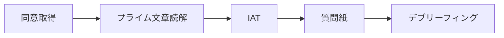

大学生 180 名を 3 条件（統制／プライム弱／プライム強）に無作為配置した．手続きの流れは下図のとおり（本文コードブロックからの Mermaid 描画の検証）．

```mermaid
flowchart LR
  s1[同意取得] --> s2[プライム文章読解] --> s3[IAT] --> s4[質問紙] --> s5[デブリーフィング]
```

除外基準（IAT エラー率 > 30%）適用後の分析対象は 172 名であった．
