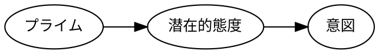

媒介モデルの推定結果（図はファイル `figures/model.dot` から描画）．本文コードブロックからの Graphviz 描画も検証する．

間接効果は $a \times b$ で，標準誤差は Sobel 検定 $z = \dfrac{ab}{\sqrt{b^2 s_a^2 + a^2 s_b^2}}$ で評価する（インライン数式 $E = mc^2$ も検証）．

$$ Y = c'X + bM + \varepsilon_Y, \qquad M = aX + \varepsilon_M $$

